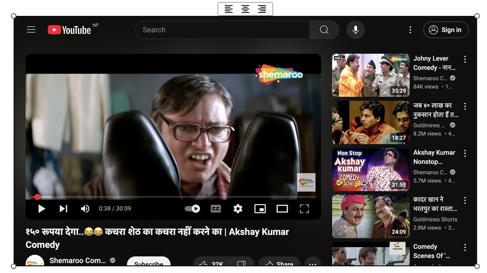

# **YoutubeResize - Resizable YouTube Embed for TipTap**

## **Overview**

**YoutubeResize** is an extension for [TipTap](https://tiptap.dev/docs/editor/extensions/nodes/youtube) that adds **resizable YouTube iframes** with drag controls and alignment options. It allows users to dynamically adjust the video size and position directly within the editor.

This extension enhances the default **TipTap YouTube extension** by introducing an **interactive UI** for resizing and aligning YouTube embeds.

---

## **Features**

✅ **Resizable YouTube Iframes** – Drag corners to resize  
✅ **Alignment Controls** – Align videos left, center, or right  
✅ **Auto-Hide UI** – Controls appear only on selection  
✅ **Seamless TipTap Integration** – Works with existing YouTube embeds  
✅ **Framework Agnostic** – Compatible with Vue, React, Angular, and more

---

## **Installation**

### **Step 1: Install the Extension**

if you use npm:

```sh
npm install @anilkumarthakur/tiptap-extension-resize-youtube
```

if you use yarn:

```sh
yarn add @anilkumarthakur/tiptap-extension-resize-youtube
```

if you use pnpm:

```sh
pnpm add @anilkumarthakur/tiptap-extension-resize-youtube
```

if you use bun:

```sh
bun add @anilkumarthakur/tiptap-extension-resize-youtube
```

### **Step 2: Import and Use in TipTap Editor**

```ts
import { YoutubeResize } from '@anilkumarthakur/tiptap-extension-resize-youtube'

new Editor({
  extensions: [
    ...OtherExtensions,
    YoutubeResize.configure({
      controls: true,
      nocookie: true,
      width: 640,
      height: 480,
      allowFullscreen: true,
      autoplay: false
    })
  ],
  ...OtherOptions
})
```

---

## **Usage**

- Click on an embedded **YouTube video** to activate **resize handles** and **alignment controls**.
- **Drag the corner dots** to dynamically **resize** the iframe.
- **Click alignment buttons** to move the video **left, center, or right**.
- **Click outside the video** to hide the controls.

---

## **Why Use YoutubeResize?**

Unlike the default TipTap **YouTube extension**, **YoutubeResize** provides a **visual and intuitive way** to resize and align YouTube videos **without manually adjusting HTML attributes**.

---

## **Compatibility**

- Works with **Vue.js, React, Angular, and any framework** using TipTap.
- Requires `@tiptap/extension-youtube` as a dependency.

---

## **License**

This project is open-source and available under the **MIT License**.

---

## **Contributing**

Contributions are welcome! Feel free to open issues or submit pull requests.

🚀 **Happy Coding!** 🚀

